# Chapter 2: Fundamentals of Ethernet LANs

**Same-layer interaction**: The two computers use a protocol to communicate with the same layer on another computer. The protocol defines a header that communicates what each computer wants to do

**Adjacent-layer interaction**: On a single computer, one lower layer provides a service to the layer just above. The software or hardware that implements the higher layer requests that the next lower layer perform the needed function

## Transmitting Data Using Twisted Pairs
- To send data, the two devices follow some rules called an **encoding scheme**
  - The idea works a lot like when two people talk using the same language
  - The speaker says some words in a particular language, and the listener, because she speaks the same language, can understand the spoken words
- With an encoding scheme, the transmitting node changes the electrical signal over time, while the other node, the receiver, using the same rules, interprets those changes as either 0s or 1s
- For example, 10BASE-T uses an encoding scheme that encodes a binary 0 as a transition from higher voltage to lower voltage during the middle of a 1/10,000,000th-of-a-second interval
- Note that in an actual UTP cable, the wires will be twisted together, instead of being parallel
- Twisting the wire pairs together helps cancel out most of the EMI, so most networking physical links that use copper wires use twisted pairs
- EMI between wire pairs in the same cable is called **crosstalk**

## Breaking Down a UTP Ethernet Link
- The term **Ethernet link** refers to any physical cable between two Ethernet nodes
- The 10BASE-T and 100BASE-T standards require two pairs of wires, while the 1000BASE-T standard requires four pairs
- Each wire has a color-coded plastic coating, with the wires in a pair having a color scheme
- For example, for the blue wire pair, one wire’s coating is all blue, while the other wire’s coating is blue and-white striped
- Many Ethernet UTP cables use an RJ-45 connector on both ends
- The RJ-45 connector has eight physical locations into which the eight wires in the cable can be inserted, called pin positions, or simply pins
- Some Cisco switches include physical ports whose port hardware (the transceiver) can be changed later, after you purchase the switch
- An example of this is SFP and SFP+

## Straight Through Cable Pinout
- 10BASE-T and 100BASE-T use two pairs of wires in a UTP cable, one for each direction, as shown in Figure 2-9
- The figure shows four wires, all of which sit inside a single UTP cable that connects a PC and a LAN switch
- In this example, the PC on the left transmits using the top pair, and the switch on the right transmits using the bottom pair

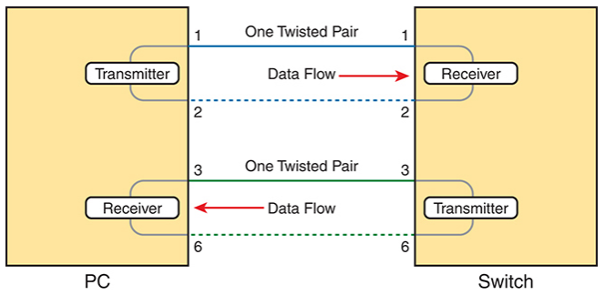  

- As a rule, Ethernet NIC transmitters use the pair connected to pins 1 and 2; the NIC receivers use a pair of wires at pin positions 3 and 6
- LAN switches, knowing those facts about what Ethernet NICs do, do the opposite:
  - Their receivers use the wire pair at pins 1 and 2, and their transmitters use the wire pair at pins 3 and 6
- The switch effectively reverses the transmit and receive logic of the endpoint device
- To make the preceding logic work, the UTP cable must use a **straight-through cable** pinout convention
- An Ethernet straight through cable connects the wire at pin 1 on one end of the cable to pin 1 at the other end of the cable; the wire at pin 2 needs to connect to pin 2 on the other end of the cable; pin 3 on one end connects to pin 3 on the other, and so on
- Figure 2-10 shows the concept of straight-through pinout with two pairs—one pair at pins 1,2 and another at pins 3,6, as used by 10BASE-T and 100BASE-T:

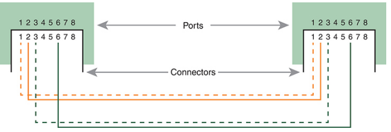  

- A straight-through cable works correctly when the nodes use opposite pairs for transmitting data
- However, when connecting two devices that transmit on the same pins, you then need another type of cabling pinout called a crossover cable pinout
- The crossover cable pinout crosses the pair at the transmit pins on each device to the receive pins on the opposite device
- Figure 2-11 shows this:

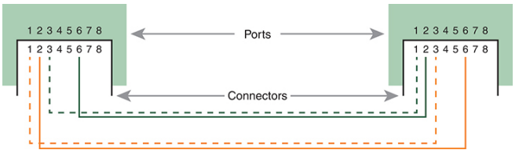

## Choosing the Right Cable Pinouts
- The key is to know whether a device acts like a PC NIC, transmitting at pins 1 and 2, or like a switch, transmitting at pins 3 and 6. Then, just apply the following logic: 
  - Crossover cable: If the endpoints transmit on the same pin pair 
  - Straight-through cable: If the endpoints transmit on different pin pairs
- Table 2-3 lists the devices and the pin pairs they use, assuming that they use 10BASE-T and 100BASE-T

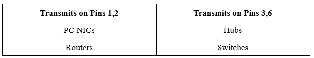

- Figure 2-12 shows a campus LAN in a single building. In this case, several straight-through cables are used to connect PCs to switches. In addition, the cables connecting the switches require crossover cables:

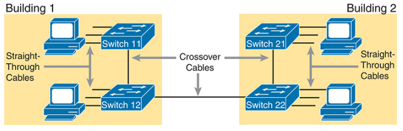

## Automatic Rewiring with Auto-MDIX
- If the link needs a crossover cable, but the installer connected a straight-through cable, this feature can sense the incorrect pinout, and then redirect the electrical signals to the correct pairs to compensate so that the link works
- The Ethernet standard calls this feature automatic medium-dependent interface crossover (auto-MDIX)
- Auto-MDIX allows sites to use straight-through pinouts on all cables
- On the links that need a crossover pinout, the auto-MDIX on the switch port will sense the use of the straight-through pinout and then internally swap the pairs used by the transceiver to make the link work

## UTP Cabling Pinouts for 1000BASE-T
- 1000BASE-T requires four wire pairs and it also uses more advanced electronics that allow both ends to transmit and receive simultaneously on each wire pair
- The wiring pinouts for 1000BASE-T work almost identically to the earlier standards, adding details for the additional two pairs
- The straight-through cable for 1000BASE-T uses the four wire pairs to create four circuits, but the pins need to match
- It uses the same pinouts for two pairs as do the 10BASE-T and 100BASE-T standards, and it adds a pair at pins 4 and 5 and another pair at pins 7 and 8, as shown in Figure 2-13

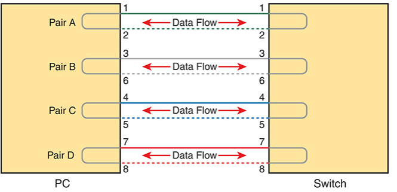

- 1000BASE-T (Gigabit Ethernet) uses straight-through cable pinout for some links but crossover cables in other cases
- The Gigabit Ethernet crossover cable crosses pairs A and B in the figure (the pairs at pins 1,2 and 3,6) and also pairs C and D (the pair at pins 4,5 with the pair at pins 7,8)

## Fiber Cabling Transmission Concepts
- Fiber-optic cabling uses glass as the medium through which light passes, varying that light over time to encode 0s and 1s
- Fiber-optic cables use fiberglass, which allows a manufacturer to spin a long thin string (fiber) of flexible glass
- A fiber-optic cable holds the fiber in the middle of the cable, allowing the light to pass through the glass
- Figure 2-14 shows a cutout with the components of a fiber cable for perspective

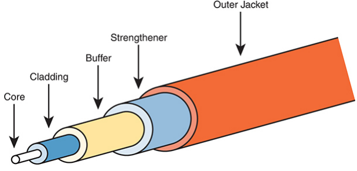

- The three outer layers of the cable protect the interior of the cable and make the cables easier to install and manage, while the inner cladding and core work together to create the environment to allow transmission of light over the cable
- A light source, called the **optical transmitter**, shines a light into the core
- Light can pass through the core; however, light reflects off the cladding back into the core
- Figure 2-15 shows an example with a light-emitting diode (LED) transmitter. You can see how the cladding reflects the light back into the core as it travels through the core: 

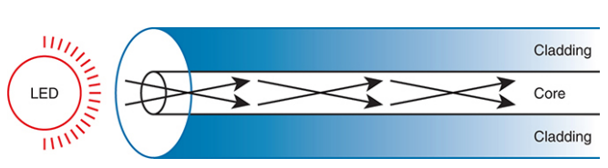

- The figure shows the normal operation of a **multimode fiber**, characterized by the fact that the cable allows for multiple angles (modes) of light waves entering the core
- In contrast, **single-mode fiber** uses a smaller-diameter core, around one-fifth the diameter of common multimode cables
- To transmit light into a much smaller core, a laser-based transmitter sends light at a single angle (hence the name single-mode)

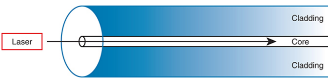

- Multimode improves the maximum distances over UTP, and it uses less expensive transmitters as compared with single-mode
- To transmit between two devices, you need two cables, one for each direction
- Note that the transmit port on one device connects to a cable that connects to a receive port on the other device, and vice versa with the other cable

## Using Fiber with Ethernet
- To use fiber with Ethernet switches, you need to use a switch with either built-in ports that support a particular optical Ethernet standard, or a switch with modular ports that allow you to change the Ethernet standard used on the port

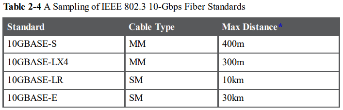

- Although distance might be the first criterion to consider when thinking about whether to use UTP or fiber cabling, a few other tradeoffs exist as well
- UTP wins again on cost, because the cost goes up as you move from UTP, to multimode, and then to single-mode, due to the extra cost for the transmitters like the SFP and SFP+ modules
- UTP has some negatives, however. First, UTP might work poorly in some electrically noisy environments such as factories, because UTP can be affected by electromagnetic interference (EMI)
- Also, UTP cables emit a faint signal outside the cable, so highly secure networks may choose to use fiber, which does not create similar emissions, to make the network more secure

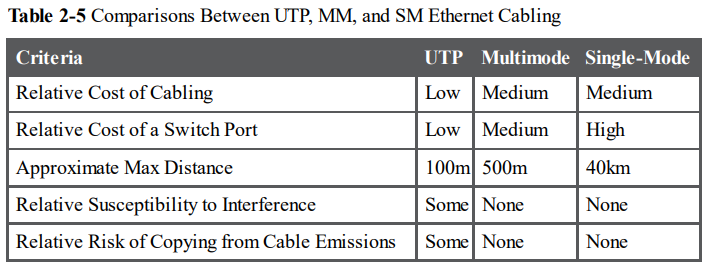

## Ethernet Data Link Protocols
- The Ethernet data-link protocol defines the Ethernet frame: an Ethernet header at the front, the encapsulated data in the middle, and an Ethernet trailer at the end
- Ethernet actually defines a few alternate formats for the header, with the frame format shown in Figure 2-18 being commonly used today:

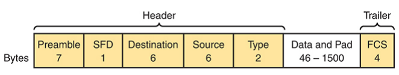

- Table 2-6 lists the fields in the header and trailer and a brief description for reference:

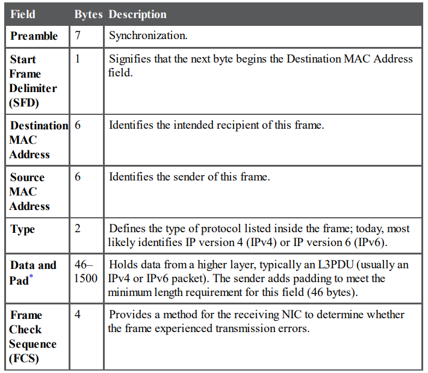

## Ethernet Addressing
- Ethernet addresses, also called Media Access Control (MAC) addresses, are 6-byte long (48-bit-long) binary numbers
- Most MAC addresses represent a single NIC or other Ethernet port, so these addresses are often called a unicast Ethernet address
- Before a manufacturer can build Ethernet products, it must ask the IEEE to assign the manufacturer a universally unique 3-byte code, called the **organizationally unique identifier (OUI)**
- The manufacturer agrees to give all NICs (and other Ethernet products) a MAC address that begins with its assigned 3-byte OUI
- The manufacturer also assigns a unique value for the last 3 bytes, a number that manufacturer has never used with that OUI

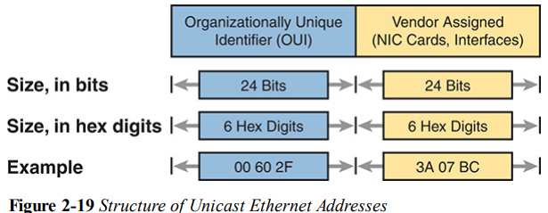

- In addition to unicast addresses, Ethernet also uses group addresses
- The IEEE defines two general categories of group addresses for Ethernet:
  - **Broadcast address**: Frames sent to this address should be delivered to all devices on the Ethernet LAN. It has a value of FFFF.FFFF.FFFF
  - **Multicast addresses**: Frames sent to a multicast Ethernet address will be copied and forwarded to a subset of the devices on the LAN that volunteers to receive frames sent to a specific multicast address

## Identifying Network Layer Protocols with the Ethernet Type Field 
- The Ethernet Type field, or EtherType, sits in the Ethernet data-link layer header, but its purpose is to directly help the network processing on routers and hosts
- Basically, the Type field identifies the type of network layer (Layer 3) packet that sits inside the Ethernet frame
- The original host has a place to insert a value (a hexadecimal number) to identify the type of packet encapsulated inside the Ethernet frame
- IEEE manages a list of EtherType values, so that every network layer protocol that needs a unique EtherType value can have a number
- The sender just has to know the list (Anyone can view the list; just go to www.ieee.org and search for EtherType)
- For example, a host can send one Ethernet frame with an IPv4 packet and the next Ethernet frame with an IPv6 packet. Each frame would have a different Ethernet Type field value, using the values reserved by the IEEE, as shown in Figure 2-20:

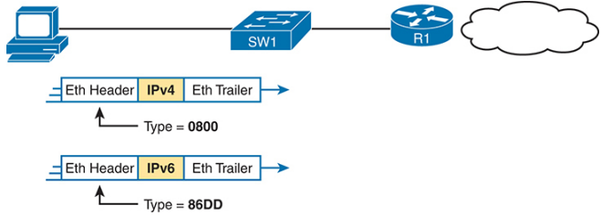

## Error Detection with FCS
- The Ethernet Frame Check Sequence (FCS) field in the Ethernet trailer—the only field in the Ethernet trailer—gives the receiving node a way to compare results with the sender, to discover whether errors occurred in the frame
- The sender applies a complex math formula to the frame before sending it, storing the result of the formula in the FCS field
- The receiver applies the same math formula to the received frame
- The receiver then compares its own results with the sender’s results. If the results are the same, the frame did not change; otherwise, an error occurred and the receiver discards the frame
- Ethernet defines that the errored frame should be discarded, but Ethernet does not attempt to recover the lost frame

## Sending in Modern Ethernet LANs Using Full Duplex
- **Half duplex**: The device must wait to send if it is currently receiving a frame; in other words, it cannot send and receive at the same time
- **Full duplex**: The device does not have to wait before sending; it can send and receive at the same time

## Using Half Duplex with LAN Hubs
- LAN hubs forward data using physical layer standards rather than data-link standards and are therefore considered to be Layer 1 devices
- When an electrical signal comes in one hub port, the hub repeats that electrical signal out all other ports (except the incoming port)
- The downside of using LAN hubs is that if two or more devices transmitted a signal at the same instant, the electrical signals collide and become garbled
- To prevent these collisions, the Ethernet nodes must use half-duplex logic instead of full-duplex logic
- Half-duplex logic tells the nodes that if someone else is sending, wait before sending
- Nodes that use half-duplex logic actually use a relatively well-known algorithm called carrier sense multiple access with collision detection (CSMA/CD)
- The algorithm takes care of the obvious cases but also the cases caused by unfortunate timing
- How CSMA/CD works:
  1. A device with a frame to send listens until the Ethernet is not busy
  2. When the Ethernet is not busy, the sender begins sending the frame
  3. The sender listens while sending to discover whether a collision occurs; collisions might be caused by many reasons, including unfortunate timing. If a collision occurs, all currently sending nodes do the following:
     - They send a jamming signal that tells all nodes that a collision happened
     - They independently choose a random time to wait before trying again, to avoid unfortunate timing
     - The next attempt starts again at Step 1
- For all links between PCs and switches, or between switches, use full duplex
- However, for any link connected to a LAN hub, the connected LAN switch and NIC port should use half duplex

# Leased Line WANS
- To connect LANs using a WAN, the internetwork uses a router connected to each LAN, with a WAN link between the routers
- For the WAN link, the enterprise’s network engineer must do some planning and then order some kind of WAN link from a WAN service provider
- That provider installs the WAN link between the two routers, as shown in Figure 3-1:

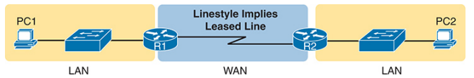

- The leased line service, a physical layer service, delivers bits in both directions, at a predetermined speed, using full-duplex logic
- The leased line uses two pairs of wires, one pair for each direction of sending data, which allows full-duplex operation

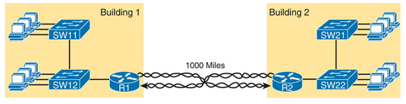

- To create a leased line, some physical path must exist between the two routers on the ends of the link
- The physical cabling must leave the customer buildings where each router sits; however, the telco does not simply install one cable between the two buildings
- Instead, it uses what is typically a large and complex network that creates the appearance of a cable between the two routers
- Figure 3-3 shows a conceptual view of a small part of the telco network
- Telcos put their equipment in buildings called central offices (COs). The telco installs cables from the CO to most every other building in the city, expecting to sell services to the people in those buildings one day
- The telco would then configure its switches to use some of the capacity on each cable to send data in both directions, creating the equivalent of a crossover cable between the two routers

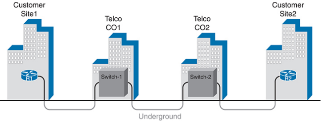

- The term leased line emphasizes the fact that the telco leases the use of the leased line to a customer, but the customer does not permanently own the line
- Many names exist for leased lines including:
  - **Leased circuit, Circuit**: The words line and circuit are often used as synonyms in telco terminology; circuit makes reference to the electrical circuit between the two endpoints
  - **Serial link, Serial line**: The words link and line are also often used as synonyms. Serial in this case refers to the fact that the bits flow serially and that routers use serial interfaces
  - **Point-to-point link, Point-to-point line**: These terms refer to the fact that the topology stretches between two points, and two points only (Some older leased lines allowed more than two devices)
  - **T1**: This specific type of leased line transmits data at 1.544 megabits per second (1.544 Mbps)
  - **WAN link, Link**: Both of these terms are very general, with no reference to any specific technology
  - **Private line**: This term refers to the fact that the data sent over the line cannot be copied by other telco customers, so the data is private

## Data-Link Details of Leased Lines 
- A leased line provides a Layer 1 service
- Routers on the ends of the line use one of two data-link protocols: High Level Data Link Control (HDLC) or Point-to-Point Protocol (PPP)
- All data-link protocols perform a similar role: to control the correct delivery of data over a physical link of a particular type
- For example, the Ethernet data-link protocol uses a destination address field to identify the correct device that should receive the data and an FCS field that allows the receiving device to determine whether the data arrived correctly
- Figure 3-4 shows the HDLC frame format as an example, with Table 3-3 that follows describing the fields
- However, note that HDLC and PPP have a similar frame format, although the newer PPP (defined in the 1990s) has more features and functions (plus additional optional headers) than the older HDLC (defined in the 1970s)

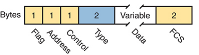

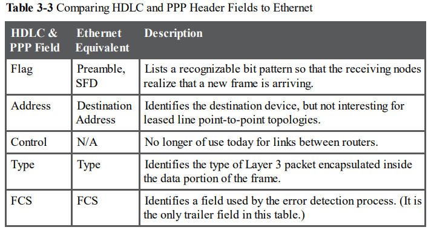

## How Routers Use a WAN Data Link
- Leased lines connect to routers, and routers focus on delivering packets to a destination host
- However, routers physically connect to both LANs and WANs, with those LANs and WANs requiring that data be sent inside data-link frames
- The TCP/IP network layer focuses on forwarding IP packets from the sending host to the destination host. The underlying LANs and WANs just act as a way to move the packets to the next router or end-user device
- Figure 3-6 shows some of the data-link layer logic used by the hosts and routers
- Basically, three separate data-link layer steps encapsulate the packet, inside a data-link frame, over three hops through the internetwork: from PC1 to R1, from R1 to R2, and from R2 to PC2

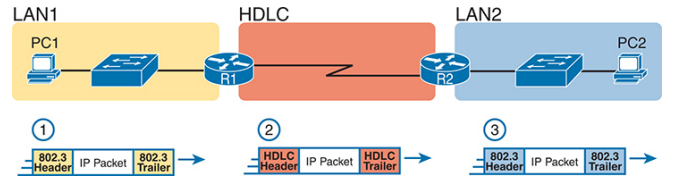

- Following the steps in the figure, again for a packet sent by PC1 to PC2’s IP address: 
  1. To send the IP packet to Router R1 next, PC1 encapsulates the IP packet in an Ethernet frame that has the destination MAC address of R1
  2. Router R1 de-encapsulates (removes) the IP packet from the Ethernet frame, encapsulates (inserts) the packet into an HDLC frame using an HDLC header and trailer, and forwards the HDLC frame to Router R2 next
  3. Router R2 de-encapsulates (removes) the IP packet from the HDLC frame, encapsulates (inserts) the packet into an Ethernet frame that has the destination MAC address of PC2, and forwards the Ethernet frame to PC2
- In summary, a leased line with HDLC creates a WAN link between two routers so that they can forward packets for the devices on the attached LANs
- The leased line itself provides the physical means to transmit the bits, in both directions
- The HDLC frames provide the means to encapsulate the network layer packet correctly so that it crosses the link between routers
- By today’s standards, leased-line WAN links are slow, with the fastest leased line speeds in the tens of megabits per second (Mbps)

## Ethernet as a WAN Technology
- Today, many WAN service providers (SP) offer WAN services that take advantage of Ethernet
- SPs offer a wide variety of these Ethernet WAN services, with many different names. But all of them use a similar model, with Ethernet used between the customer site and the SP’s network, as shown in Figure 3-7

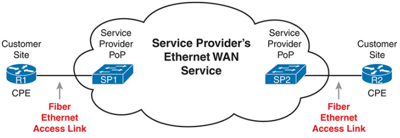

- The customer connects to an Ethernet link using a router interface
- The (fiber) Ethernet link leaves the customer building and connects to some nearby SP location called a point of presence (PoP)
- Inside the SP’s network, the SP uses any technology that it wants to create the specific Ethernet WAN services

## Ethernet WANs That Create a Layer 2 Service 
- The most basic Ethernet WAN service, one that works much like an Ethernet crossover cable—just over a WAN. In other words: 
  - Logically, behaves like a point-to-point connection between two routers
  - Physically, behaves as if a physical fiber Ethernet link existed between the two routers 
- Common Ethernet WAN service names:
  - **Ethernet WAN**: A generic name to differentiate it from an Ethernet LAN
  - **Ethernet point-to-point link**: A term that emphasizes the topology of a typical Ethernet WAN link that has exactly two endpoints: the routers on the two ends of the link
  - **Ethernet Line Service (E-Line)**: A term from the Metro Ethernet Forum (MEF) for the kind of point-to-point Ethernet WAN service shown throughout this book
  - **Ethernet over MPLS (EoMPLS)**: A term that refers to Multiprotocol Label Switching (MPLS), a technology that can be used to create the Ethernet service for the customer
- If you can imagine two routers, with a single Ethernet link between the two routers, you understand what this particular Ethernet WAN service does, as shown in Figure 3- 8
- In this case, the two routers, R1 and R2, connect with an Ethernet WAN service instead of a serial link
- The routers use Ethernet interfaces, and they can send data in both directions at the same time
- Physically, each router actually connects to some SP PoP, as shown earlier in - Figure 3-7, but logically, the two routers can send Ethernet frames to each other over the link

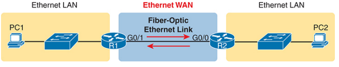

## How Routers Route IP Packets Using Ethernet WAN Links
- WANs, by their very nature, give IP routers a way to forward IP packets from a LAN at one site, over the WAN, and to another LAN at another site
- The routing logic works the same whether the WAN link happens to be a serial link or an Ethernet WAN link, with the encapsulation details being slightly different
- With an Ethernet WAN link, the link uses Ethernet for both Layer 1 and Layer 2 functions, so the routers encapsulate using the familiar Ethernet header and trailer, as shown in the middle of Figure 3-9

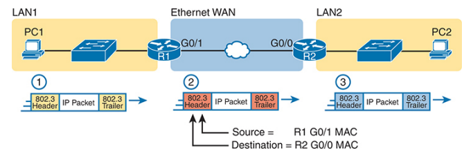

- The figure shows the same three routing steps as shown with the serial link in the earlier Figure 3-6
- In this case, all three routing steps use the same Ethernet (802.3) protocol, however note that each frame’s data-link header and trailer are different
- Each router discards the old data-link header/trailer and adds a new set, as described in these steps:
  1. To send the IP packet to Router R1 next, PC1 encapsulates (inserts) the IP packet in an Ethernet frame that has the destination MAC address of R1. 
  2. Router R1 de-encapsulates (removes) the IP packet from the Ethernet frame and encapsulates (inserts) the packet into a new Ethernet frame, with a new Ethernet header and trailer. The destination MAC address is R2’s G0/0 MAC address, and the source MAC address is R1’s G0/1 MAC address. R1 forwards this frame over the Ethernet WAN service to R2 next
  3. Router R2 de-encapsulates (removes) the IP packet from the Ethernet frame, encapsulates (inserts) the packet into an Ethernet frame that has the destination MAC address of PC2, and forwards the Ethernet frame to PC2

## How Network Layer Routing Uses LANs and WANs 
- The following list summarizes the major steps in a router’s internal network layer routing for each packet beginning with the frame arriving in a router interface: 
  1. Use the data-link Frame Check Sequence (FCS) field to ensure that the frame had no errors; if errors occurred, discard the frame
  2. Assuming that the frame was not discarded at Step 1, discard the old datalink header and trailer, leaving the IP packet
  3. Compare the IP packet’s destination IP address to the routing table, and find the route that best matches the destination address. This route identifies the outgoing interface of the router and possibly the next-hop router IP address
  4. Encapsulate the IP packet inside a new data-link header and trailer, appropriate for the outgoing interface, and forward the frame
- Figure 3-11 works through an example of a packet sent by PC1 to PC2, followed by a detailed analysis of each device’s routing logic:

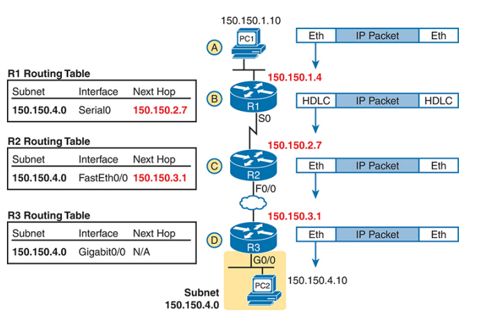

## The IP Header
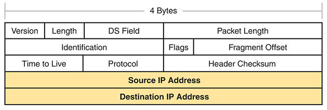

## How IP Routing Protocols Help IP Routing 
- The best method for routers to know all the useful routes is to configure the routers to use the same IP routing protocol
- If you enable the same routing protocol on all the routers in a TCP/IP internetwork, with the correct settings, the routers will send routing protocol messages to each other
- As a result, all the routers will learn routes for all the IP networks and subnets in the TCP/IP internetwork
- All the routing protocols use the same general steps for learning routes:
  1. Each router, independent of the routing protocol, adds a route to its routing table for each subnet directly connected to the router
  2. Each router’s routing protocol tells its neighbors about the routes in its routing table, including the directly connected routes and routes learned from other routers
  3. Each router’s routing protocol listens to messages from neighboring routers and learns routes, with the next-hop router of that route typically being the neighbor from which the route was learned
- Note that at the final step, routers may have to choose between multiple routes to reach a single subnet
- When that happens, routers place the best currently available route to reach a subnet (based on a measurement called a metric) into the routing table
- Figure 3-13 shows an example of how a routing protocol works

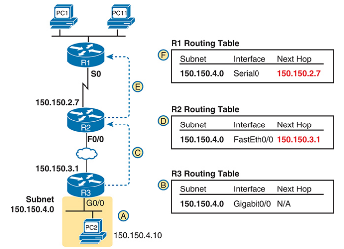

- Below lists out the steps for the above image
  - Subnet 150.150.4.0 exists as a subnet at the bottom of the figure, connected to Router R3
  - R3 adds a connected route for 150.150.4.0 to its IP routing table; this happens without help from the routing protocol
  - R3 sends a routing protocol message, called a routing update, to R2, causing R2 to learn about subnet 150.150.4.0
  - R2 adds a route for subnet 150.150.4.0 to its routing table
  - R2 sends a similar routing update to R1, causing R1 to learn about subnet 150.150.4.0
  - R1 adds a route for subnet 150.150.4.0 to its routing table. The route lists R1’s own Serial0 as the outgoing interface and R2 as the next-hop router IP address (150.150.2.7)

## The Address Resolution Protocol
- TCP/IP defines the Address Resolution Protocol (ARP) as the method by which any host or router on a LAN can dynamically learn the MAC address of another IP host or router on the same LAN
- ARP defines a protocol that includes the ARP Request, which is a message that makes the simple request “if this is your IP address, please reply with your MAC address”
- ARP also defines the ARP Reply message, which indeed lists both the original IP address and the matching MAC address
- The figure shows the ARP Request sent by router R3, on the left of the figure, as a LAN broadcast
- All devices on the LAN will then process the received frame
- On the right, at Step 2, host PC2 sends back an ARP Reply, identifying PC2’s MAC address

- Hosts and routers remember the ARP results, keeping the information in their ARP cache or ARP table
- A host or router only needs to use ARP occasionally, to build the ARP cache the first time
- Each time a host or router needs to send a packet encapsulated in an Ethernet frame, it first checks its ARP cache for the correct IP address and matching MAC address
- Hosts and routers will let ARP cache entries time out to clean up the table, so occasional ARP Requests can be seen
- You can see the contents of the ARP cache on most PC operating systems by using the **arp -a** command from a command prompt

## Accessing the IOS XE CLI
- To create IOS XE, Cisco took IOS and modernized the internal software architecture
- IOS XE, often referred to simply as XE, has features to improve uptime and the ability to maintain devices without requiring rebooting (reloading) the device
- For the purposes of CCNA, almost everything you see with commands and the CLI applies to older IOS-based switches as well as newer switches that use IOS XE
- The switch CLI can be accessed through three popular methods: the console, Telnet, and Secure Shell (SSH)
- The console is a physical port built specifically to allow access to the CLI
- Console access requires both a physical connection between a PC (or other user device) and the switch’s console port, as well as some software on the PC
- Figure 4-3 depicts the options

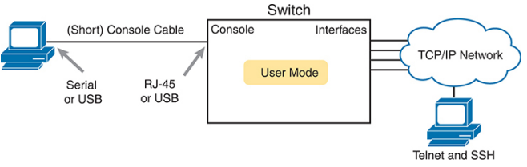

## Cabling the Console Connection
- The physical console connection, both old and new, uses three main components: the physical console port on the switch, a physical serial port on the PC, and a cable that works with the console and serial ports
- Most PCs today use a familiar standard USB connector for the console connection (often a USB mini-B connector on the switch)
- In the simplest form, you can use any USB port on the PC, with a USB cable, connected to the USB console port on the switch or router
 

- The case on the far left in the figure shows an older console connection, typical of how you would have connected to a switch over ten years ago
- Before PCs used USB ports, they used serial ports for serial communications
- The PC serial port had a D-shell connector (roughly rectangular) with nine pins (often called a DB-9)
- The console port looks like any Ethernet RJ-45 port (but is typically colored in blue and with the word console beside it on the switch)
- The older-style cabling used a standard RJ-45 to DB-9 converter plug and a UTP rollover cable with RJ-45 connectors on each end
- The rollover pinout uses eight wires, rolling the wire at pin 1 to pin 8, pin 2 to pin 7, pin 3 to pin 6, and so on
- The center case in the figure shows a variation that you might use on occasion that combines the cabling concepts from the left and right cases in the figure
- You use the USB port on your PC but the RJ-45 console port on the switch
- In fact, for some very old switch models, the switch has only an RJ-45 console port but no USB console port, requiring this kind of console cabling
- In this case, you need a USB converter plug that converts from the older rollover console cable (with RJ-45 connectors) to a USB connector
- When using the USB options, you typically also need to install a software driver so that your PC’s OS knows that the device on the other end of the USB connection is the console of a Cisco device

## Configuring a Terminal Emulator 
- After the PC is physically connected to the console port, a terminal emulator software package must be installed and configured on the PC
- The terminal emulator software treats all data as text. It accepts the text typed by the user and sends it over the console connection to the switch
- Similarly, any bits coming into the PC over the console connection are displayed as text for the user to read
- The emulator must be configured to use the PC’s serial port to match the settings on the switch’s console port settings
- The default console port settings on a switch are as follows
  - 9600 bits/second
  - No hardware flow control 
  - 8-bit ASCII
  - No parity bits
  - 1 stop bit
- Note that the last three parameters are referred to collectively as 8N1

## User and Enable (Privileged) Modes
- All three CLI access methods covered so far (console, Telnet, and SSH) place the user in an area of the CLI called user EXEC mode
- User EXEC mode, sometimes also called **user mode**, allows the user to look around but not break anything
- Cisco IOS supports a more powerful EXEC mode called privileged mode (also known as **enable mode**)
- If the command prompt ends with a **>**, the user is in user mode; if it ends with a **#**, the user is in enable mode
- The commands that can be used in either user mode or enable mode are called EXEC commands

## Password Security for CLI Access from the Console
- Simple passwords can be configured at two points in the login process from the console: when the user connects from the console, and when any user moves to enable mode (using the **enable** EXEC command)
- The command **show running-config** lists the current configuration in the switch
- Use **hostname** ***hostname*** to set the switches hostname
- Use **enable secret** ***password*** to define the password that all users must use to reach enable mode
- Use **password** ***password*** to define the password the console user must type when prompted
- **line console 0** is the command that identifies the console, basically meaning “these next commands apply to the console only”
- The **login** command tells IOS to perform simple password checking (at the console)
- Remember, by default, the switch does not ask for a password for console users

## CLI Help Features
- Table 4-3 summarizes command-recall help options available at the CLI
- Note that, in the first column, **command** represents any command. Likewise, **parm** represents a command’s parameter
- For example, the third row lists command **?**, which means that commands such as **show ?** and **copy ?** would list help for the show and copy commands, respectively

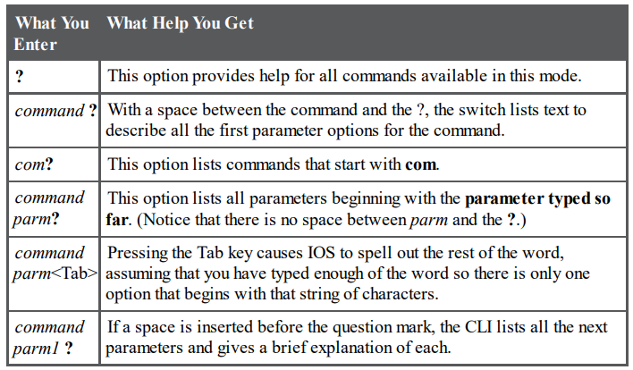

- When you enter the ?, the Cisco IOS CLI reacts immediately; that is, you don’t need to press the Enter key or any other keys
- When ? is entered in user mode, the commands allowed in user mode are displayed, but commands available only in enable mode (not in user mode) are not displayed
- Cisco IOS stores the commands that you enter in a history buffer, storing ten commands by default
- The CLI also allows you to move backward and forward in the historical list of commands and then edit the command before reissuing it
- Table 4-4 lists the commands used to manipulate previously entered commands

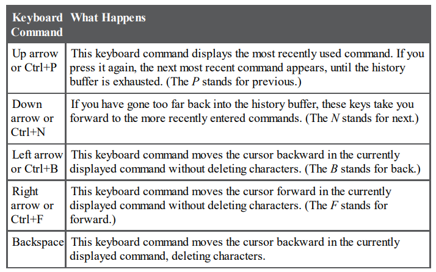

## The debug and show Commands
- The **show** command has a large variety of options, and with those options, you can find the status of almost every feature of Cisco IOS
- Essentially, the show command lists the currently known facts about the switch’s operational status
  - Ex. **show mac address-table dynamic**
- The **debug** command also tells the user details about the operation of the switch
- However, while the show command lists status information at one instant of time—more like a photograph— the debug command acts more like a live video camera feed
- Once you issue a debug command, IOS remembers, issuing messages over time as events continue to occur
- Any switch user can choose to receive those messages, with the switch sending the messages to the console by default

## Configuring Cisco IOS Software
- Configuration mode accepts configuration commands—commands that tell the switch the details of what to do and how to do it
- User and privileged modes accept EXEC commands, which return output, or possibly take an action like reloading the switch, but commands in these modes do not change any configuration settings
- Commands entered in configuration mode update the active configuration file
- These changes to the configuration occur immediately each time you press the Enter key at the end of a command
- Figure 4-11 illustrates the navigation among configuration mode, user EXEC mode, and privileged EXEC mode

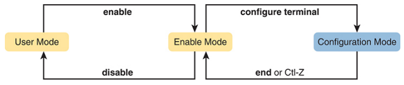

## Configuration Submodes and Contexts
- When using configuration mode, you move from the initial mode—global configuration mode—into subcommand modes
- Context-setting commands move you from one configuration subcommand mode, or context, to another
- These context-setting commands tell the switch the topic about which you will enter the next few configuration commands
- The **interface** command is one of the most commonly used context-setting configuration commands
- For example, the CLI user could enter interface configuration mode by entering the **interface FastEthernet 0/1** configuration command
- Asking for help in interface configuration mode displays only commands that are useful when configuring Ethernet interfaces
- Commands used in this context are called subcommands—or, in this specific case, interface subcommands
- Consider Example 4-4, which shows the following:
  - Movement from enable mode to global configuration mode by using the **configure terminal** EXEC command
  - Use of a **hostname Fred** global configuration command to configure the switch’s name. Using a global command from global configuration mode leaves you in global configuration mode
  - Movement from global configuration mode to console line configuration mode (using the **line console 0** command). The **line** command is another of the small set of context-setting commands that move you to another submode
  - Setting the console’s simple password to hope (using the **password hope** line subcommand). Using a subcommand while in that submode leaves the command prompt in that submode
  - Movement from console configuration mode to interface configuration mode (using the **interface ***type number***** command). The interface command is another of the small set of context-setting commands that move you to another submode
  - Setting the speed to 100 Mbps for interface Fa0/1 (using the **speed 100** interface subcommand)
  - Movement from interface configuration mode back to global configuration mode (using the **exit** command)

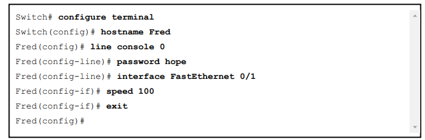

- Table 4-5 shows the most common command prompts in configuration mode, the names of those modes, and the context-setting commands used to reach those modes

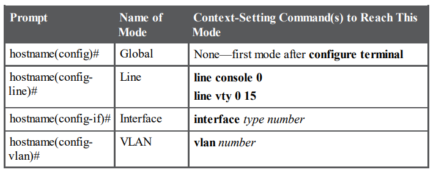

- Figure 4-12 shows most of the navigation between global configuration mode and the four configuration submodes listed in Table 4-5

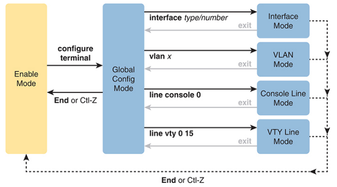

- Generally, Cisco uses global commands for settings that apply to the entire switch and subcommands that apply to one component or feature

## Storing Switch Configuration Files
- To store information that must be retained when the switch loses power or is reloaded, Cisco switches use several types of more permanent memory, none of which has any moving parts
- The following list details the four main types of memory found in Cisco switches, as well as the most common use of each type:
  - **RAM**: Sometimes called DRAM, for dynamic random-access memory, RAM is used by the switch just as it is used by any other computer: for working storage. The running (active) configuration file is stored here 
  - **Flash memory**: Either a chip inside the switch or a removable memory card, flash memory stores fully functional Cisco IOS images and is the default location where the switch gets its Cisco IOS at boot time. Flash memory also can be used to store any other files, including backup copies of configuration files
  - **ROM**: Read-only memory (ROM) stores a bootstrap (or boothelper) program that is loaded when the switch first powers on. This bootstrap program then finds the full Cisco IOS image and manages the process of loading Cisco IOS into RAM, at which point Cisco IOS takes over operation of the switch
  - **NVRAM**: Nonvolatile RAM (NVRAM) stores the initial or startup configuration file that is used when the switch is first powered on and when the switch is reloaded 
- Figure 4-13 summarizes this same information in a briefer and more convenient form

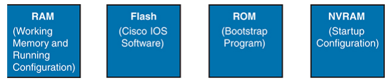

- Cisco IOS stores the collection of configuration commands in a configuration file
- Switches use multiple configuration files—one file for the initial configuration used when powering on, and another configuration file for the active, currently used running configuration as stored in RAM
- Table 4-6 lists the names of these two files, their purpose, and their storage location

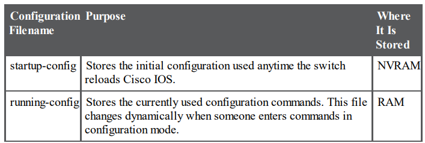

- Essentially, when you use configuration mode, you change only the running-config file
- If you want to keep the configuration, you have to copy the running-config file into NVRAM, overwriting the old startup-config file

## Copying and Erasing Configuration Files
- The configuration process updates the running-config file, which is lost if the router loses power or is reloaded
- The EXEC command **copy running-config startup-config** backs up the running config to the startup-config file. This command overwrites the current startup-config file with what is currently in the running-config file
- You can erase the startup-config file using three different commands:
  - **write erase**
  - **erase startup-config** 
  - **erase nvram:** 
- Once the startup-config file is erased, you can reload or power off/on the switch, and it will boot with the now-empty startup configuration
- To clear out the running-config file, simply erase the startup-config file, and then reload the switch, and the running-config will be empty at the end of the process

## Overview of Switching Logic
- LAN switches receive Ethernet frames and then make a switching decision: either forward the frame out to some other ports or ignore the frame
- To accomplish this primary mission, switches perform three actions: 
  - Deciding when to forward a frame or when to filter (not forward) a frame, based on the destination MAC address
  - Preparing to forward future frames by learning the source MAC address of each frame received by the switch
  - Cooperating with all switches to prevent the endless looping of frames by using Spanning Tree Protocol (STP)
- The first action is the switch’s primary job, whereas the other two items are overhead functions

## Forwarding Known Unicast Frames
- To decide whether to forward a frame, a switch uses a dynamically built table that lists MAC addresses and outgoing interfaces
- Switches compare the frame’s destination MAC address to this table to decide whether the switch should forward a frame or simply ignore it
- For example, consider the simple network shown in Figure 5-3, with Fred sending a frame to Barney

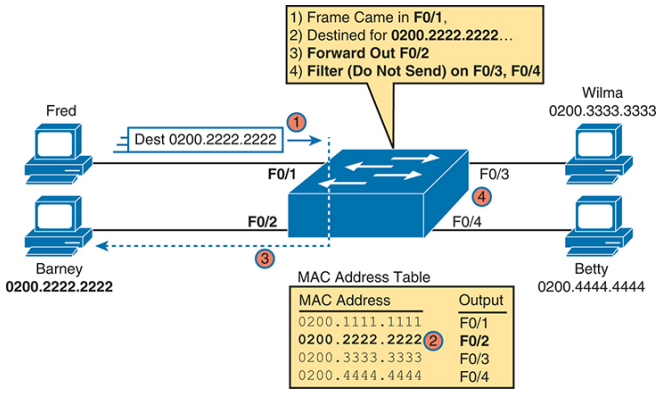

- A switch’s MAC address table is also called the switching table, or bridging table, or even the content-addressable memory (CAM) table
- A switch’s MAC address table lists the location of each MAC relative to that one switch
- In LANs with multiple switches, each switch makes an independent forwarding decision based on its own MAC address table
- The frames are called **known unicast frames**, or simply known unicasts, because the destination address is a unicast address, and the destination is known

## Learning MAC Addresses
- Switches build the address table by listening to incoming frames and examining the source MAC address in the frame
- If a frame enters the switch and the source MAC address is not in the MAC address table, the switch creates an entry in the table
- That table entry lists the interface from which the frame arrived
- Figure 5-6 depicts the same single-switch topology network as Figure 5-3, but before the switch has built any address table entries. The figure shows the first two frames sent in this network: first a frame from Fred addressed to Barney, and then Barney’s response, addressed to Fred

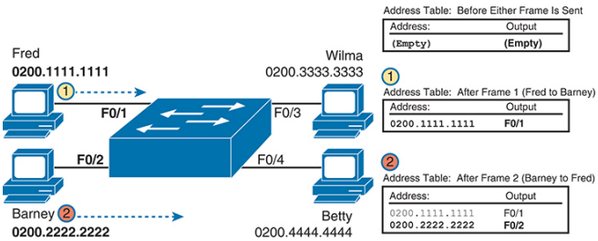

- Learning always occurs by looking at the source MAC address in the frame and adds the incoming interface as the associated port

## Flooding Unknown Unicast and Broadcast Frames
- When there is no matching entry in the table, switches forward the frame out all interfaces (except the incoming interface) using a process called **flooding**
- The frame whose destination address is unknown to the switch is called an **unknown unicast frame**, or simply an unknown unicast
- Switches flood unknown unicast frames
- The idea is simple: if you do not know where to send it, send it everywhere, to deliver the frame. And, by the way, that device will likely then send a reply—and then the switch can learn that device’s MAC address and forward future frames out one port as a known unicast frame
- Switches also flood LAN **broadcast frames** (frames destined to the Ethernet broadcast address of FFFF.FFFF.FFFF) because this process helps deliver a copy of the frame to all devices in the LAN

## Avoiding Loops Using Spanning Tree Protocol
- To prevent looping frames, STP blocks some ports from forwarding frames so that only one active path exists between any pair of LAN segments
- Figure 5-8 shows an unknown unicast frame, sent by Larry to Bob, which loops forever because the network has redundancy but no STP
- Note that the figure shows one direction of the looping frame only, just to reduce clutter, but a copy of the frame would also loop the other direction

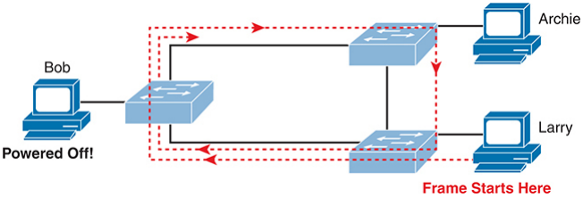

- While the flooding process is a good mechanism for forwarding unknown unicasts and broadcasts, the continual flooding of traffic frames as in the figure can completely congest the LAN to the point of making it unusable
- STP causes each interface on a switch to settle into either a blocking state or a forwarding state
- Blocking means that the interface cannot forward or receive data frames, while forwarding means that the interface can send and receive data frames
- If a correct subset of the interfaces is blocked, only a single currently active logical path exists between each pair of LANs

## LAN Switching Summary
1. Switches forward frames based on the destination MAC address: 
   - If the destination MAC address is a broadcast, multicast, or unknown destination unicast (a unicast not listed in the MAC table), the switch floods the frame
   - If the destination MAC address is a known unicast address (a unicast address found in the MAC table):
     - If the outgoing interface listed in the MAC address table is different from the interface in which the frame was received, the switch forwards the frame out the outgoing interface
     - If the outgoing interface is the same as the interface in which the frame was received, the switch filters the frame, meaning that the switch simply ignores the frame and does not forward it. 
2. Switches learn MAC address table entries based on the source MAC address:
   - For each received frame, note the source MAC address and incoming interface ID
   - If not yet in the MAC address table, add an entry listing the MAC address and incoming interface 
3. Switches use STP to prevent loops by causing some interfaces to block, meaning that they do not send or receive frames

## Demonstrating MAC Learning
- To see a switch’s MAC address table, use the **show mac address-table** command
- With no additional parameters, this command lists all known MAC addresses in the MAC table, including some overhead static MAC addresses that you can ignore
- To see all the dynamically learned MAC addresses only, instead use the **show mac address-table dynamic** command

## Switch Interfaces
- You can easily check the status of interfaces with the **show interfaces status** command
- You can see the status for a single interface in a couple of ways. For instance, for F0/1, the command **show interfaces f0/1 status** lists the status in a single line of output
- The **show interfaces f0/1** command (without the **status** keyword) displays a detailed set of messages about the interface
- The **show interfaces** command has a large number of options
- One particular option, the counters option, lists statistics about incoming and outgoing frames on the interfaces
- In particular, it lists the number of unicast, multicast, and broadcast frames (both the in and out directions), and a total byte count for those frames

## Finding Entries in the MAC Address Table
- If  you know the MAC address, you can search for it—just type in the MAC address at the end of the command **show mac address-table**
- All you have to do is include the address keyword, followed by the actual MAC address
  - For example, **show mac address-table dynamic address 0200.1111.1111**
- You may also want to find the MAC address table entries for one VLAN, which can be done with the vlan parameter, followed by the VLAN number
  - For example, **show mac address-table dynamic vlan 1**

## Managing the MAC Address Table (Aging, Clearing) 
- Switches remove entries that have not been used for a defined number of seconds (default of 300 seconds)
- To do that, switches keep a timer for each MAC table entry that increases over time
- However, the switch resets the timer to 0 when it receives another frame with that same source MAC address
- Timers that have not been reset continue to grow, and once a timer reaches the aging setting, the switch removes the MAC table entry
- The aging time can be configured to a different time, globally and per-VLAN using the **mac address-table aging-time** ***time-in-seconds [vlan vlan-number]*** global configuration command
- Each switch also removes the oldest table entries, even if they are younger than the aging time setting, if the table fills
- The MAC address table uses content-addressable memory (CAM), a physical memory that has great table lookup capabilities
- The size of the table depends on the size of the CAM in a particular model of switch and based on some configurable settings in the switch
- You can remove the dynamic entries from the MAC address table with the **clear mac address-table dynamic** command
- Note that the show commands in this chapter can be executed from user and enable mode, but the clear command happens to be an enable mode command
- The command also allows parameters to limit the types of entries cleared, as follows:
  - By VLAN: **clear mac address-table dynamic vlan** ***vlan-number***
  - By Interface: **clear mac address-table dynamic interface** ***interface-id***
  - By MAC address: **clear mac address-table dynamic address** ***mac-address***

## Securing the Switch CLI 
- By default, a user can connect to the console and reach enable mode with no security checks and no passwords required
- In contrast, the default settings disallow all Telnet and Secure Shell (SSH) users from even seeing a login prompt
- Securing the CLI includes protecting access to enable mode, because from enable mode, an attacker could reload the switch or change the configuration
- Protecting user mode is also important, because attackers can see the status of the switch, learn about the network, and find new ways to attack the network

## Securing User Mode and Privileged Mode with Simple Passwords 
- Most people use a simple shared password for access to lab gear
- This method uses a password only—with no username—with one password for console users and a different password for Telnet users
- Console users must supply the console password, as configured in console line configuration mode
- Telnet users must supply the Telnet password, also called the vty password, so called because the configuration sits in vty line configuration mode
- Figure 6-1 summarizes these options for using shared passwords from the perspective of the user logging in to the switch

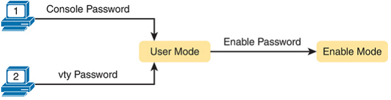

- In addition, Cisco switches protect enable mode (also called privileged mode) with yet another shared password called the enable password
- From the perspective of the network engineer connecting to the CLI of the switch, once in user mode, the user types the **enable** EXEC command
- This command prompts the user for this enable password; if the user types the correct password, IOS moves the user to enable mode
- Example 6-1 shows an example of the user experience of logging in to a switch from the console when the shared console password and the shared enable password have both been set

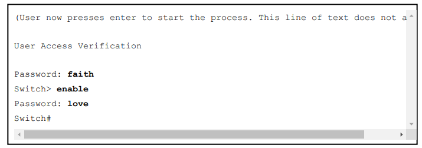

- To configure the shared passwords for the console, Telnet, and for enable mode, you need to configure several commands
- Figure 6-2 shows the configuration of all three of these passwords

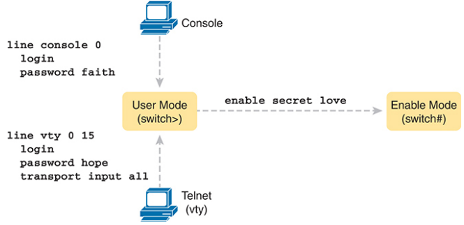

- The console and vty password configuration sets the password based on the context: console mode for the console (line con 0), and vty line configuration mode for the Telnet password (line vty 0 15)
- Then inside console mode and vty mode, respectively, the two commands in each mode are as follows: 
  - **password** ***password-value***: Defines the actual password used on the console or vty 
  - **login**: Tells IOS to enable the use of a simple shared password (with no username) on this line (console or vty), so that the switch asks the user for a password
- The command to configure the enable password is a global configuration command

## Securing User Mode Access with Local Usernames and Passwords
- Cisco switches support two other login security methods that both use per-user username/password pairs instead of a shared password with no username
- One method, referred to as local usernames and passwords, configures the username/password pairs locally—that is, in the switch’s configuration
- Switches support this local username/password option for the console, for Telnet, and even for SSH, but do not replace the enable password used to reach enable mode
- The configuration to migrate from using the simple shared passwords to instead using local usernames/passwords requires only some small configuration changes, as shown in Figure 6-3

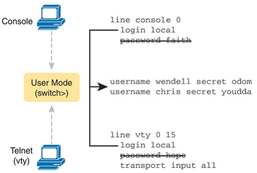

- The switch needs to know the list of username/password pairs. To create these, repeatedly use the **username** ***name*** **secret** ***password*** global configuration command
- Then, to enable this different type of console or Telnet security, simply enable this login security method with the **login local** line
- Basically, this command means “use the local list of usernames for login”
- Use the **no password** subcommand to remove any existing simple shared passwords, just for good housekeeping of the configuration file

## Securing Remote Access with Secure Shell 
- SSH can use the same local login authentication method as Telnet, with the locally configured username and password
- SSH cannot rely on authentication methods that do not include a username, like shared passwords
- The configuration to support local usernames for Telnet, as shown previously also enables local username authentication for incoming SSH connections
- Figure 6-5 shows one example configuration of what is required to support SSH
- Figure 6-5 also shows three additional commands required to complete the configuration of SSH on the switch

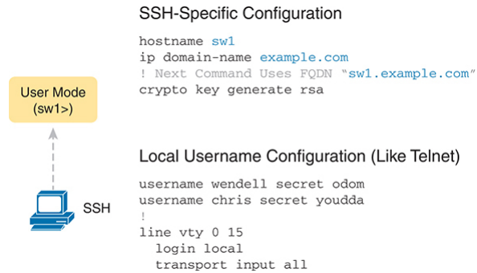

- IOS uses the three SSH-specific configuration commands in the figure to create the SSH encryption keys
- The SSH server uses the fully qualified domain name (FQDN) of the switch as input to create that key
- The switch creates the FQDN from the hostname and domain name of the switch
- The **crypto key generate rsa** command, generates the SSH encryption keys
- The **crypto key** command prompts the user for the key modulus; you could also add the parameters **modulus** ***modulus-value*** to the end of the crypto key command to add this setting on the command
- Both the Telnet and SSH examples throughout this chapter so far list the **transport input all** subcommand in vty configuration mode
- The **transport input** command identifies the protocols allowed in the vty ports, with the all keyword including SSH and Telnet
- Some common options include 
  - **transport input all** or **transport input telnet ssh**: Support both Telnet and SSH 
  - **transport input none**: Support neither
  - **transport input telnet**: Support only Telnet 
  - **transport input ssh**: Support only SSH
- Be aware of the traditional defaults: Many older switches defaulted to **transport input all**, while older routers defaulted to **transport input none**, with more recent Cisco switches and routers now defaulting to the more-secure **transport input ssh**
- The following configuration checklist details the steps for one method to configure a Cisco switch to support SSH using local usernames:
  1. Configure the switch to generate a matched public and private key pair to use for encryption:
     - If not already configured, use the **hostname** ***name*** in global configuration mode to configure a hostname for this switch
     - If not already configured, use the **ip domain name** ***name*** in global configuration mode to configure a domain name for the switch, completing the switch’s FQDN
     - Use the **crypto key generate rsa** command in global configuration mode (or the **crypto key generate rsa modulus** ***modulus-value*** command to avoid being prompted for the key modulus) to generate the keys. (Use at least a 768-bit key to support SSH version 2)
  2. (Optional) Use the **ip ssh version 2** command in global configuration mode to override the default of supporting both versions 1 and 2, so that only SSHv2 connections are allowed
  3. (Optional) If not already configured with the setting you want, configure the vty lines to accept SSH and whether to also allow Telnet:
     - Use the **transport input ssh** command in vty line configuration mode to allow SSH only
     - Use the **transport input all** command or **transport input telnet ssh** command in vty line configuration mode to allow both SSH and Telnet
  4. Use various commands in vty line configuration mode to configure local username login authentication as discussed earlier in this chapter

- Two key commands give some information about the status of SSH on the switch
- First, the **show ip ssh** command lists status information about the SSH server itself
- The **show ssh** command then lists information about each SSH client currently connected to the switch

## Enabling and Securing the WebUI
- Use the **no ip http server** global command to disable the HTTP server (port 80) (traditionally enabled by default)
- Use the **ip http secure-server** global command to enable the HTTPS server (port 443, uses TLS) (traditionally enabled by default)
- Use the **ip http authentication local** global command to define the authentication method to use locally defined usernames (traditionally defaults to use the enable password)
- Use the **username** ***name*** **priority 15 password** ***pass-value*** global command to define one or more usernames with privilege level 15
- The HTTP server has long allowed three options to log in to a device from a web browser: 
  - Using the enable password
  - Using a local username/password
  - Using the AAA settings on the device
- More recent IOS versions move away from the enable option
- To access all the features of the HTTP server (the WebUI), when using local usernames for authentication, you must configure a privilege level of 15 for the user
- IOS internally defines user privilege levels, by default creating two levels, 0 and 15
- IOS assigns user mode to level 0 and privileged mode (enable mode) to level 15
- For the WebUI, if you log in using a username with the privilege 15 option, you receive access to all WebUI features, including the ability to use the CLI configuration mode, install new software, erase the configuration, and reload the router
- So, the **username** ***name*** **priority 15 password** ***pass-value*** global command creates a way to enter privileged mode immediately (If you omit the priority 15 option and log in to the WebUI with that username you can log in, but you cannot do advanced features, including using the CLI to configure or verify a feature)

## Host and Switch IP Settings
- A switch needs the same kind of IP settings as a PC with a single Ethernet interface
- Like a PC, a switch has a real CPU, running an OS (called IOS). The switch obviously has lots of Ethernet ports, but instead of assigning its management IP address to any of those ports, the switch then uses a NIC-like concept called a switch virtual interface (SVI), or more commonly, a VLAN interface, that acts like the switch’s own NIC
- Then the settings on the switch look something like a host, with the switch configuration assigning IP settings, like an IP address, to this VLAN interface, as shown in Figure 6-6

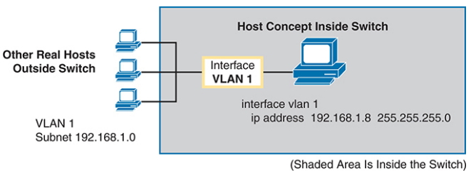

- By using interface VLAN 1 for the IP configuration, the switch can then send and receive frames on any of the ports in VLAN 1
- In a Cisco switch, by default, all ports are assigned to VLAN 1
- A Layer 2 Cisco LAN switch needs only one IP address for management purposes. However, you can choose to use any VLAN to which the switch connects
- For example, Figure 6-7 shows a Layer 2 switch with some physical ports in two different VLANs (VLANs 1 and 2)
- The figure also shows the subnets used on those VLANs. The network engineer could choose to use either
  - Interface VLAN 1, with an IP address in subnet 192.168.1.0
  - Interface VLAN 2, with an IP address in subnet 192.168.2.0

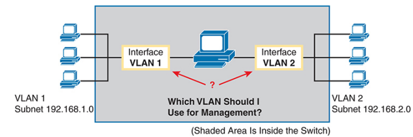

- Note that you should not try to use a VLAN interface for which there are no physical ports assigned to the same VLAN
- If you do, the VLAN interface will not reach an up/up state, and the switch will not have the physical ability to communicate outside the switch
- Configuring the IP address (and mask) on one VLAN interface allows the switch to send and receive IP packets with other hosts in a subnet that exists on that VLAN; however, the switch cannot communicate outside the local subnet without another configuration setting called the default gateway

## Configuring IPv4 on a Switch
- The following steps list the commands used to configure IPv4 on a switch, assuming that the IP address is configured to be in VLAN 1, with Example 6-7 that follows showing an example configuration
  1. Use the **interface vlan 1** command in global configuration mode to enter interface VLAN 1 configuration mode
  2. Use the **ip address** ***ip-address mask*** command in interface configuration mode to assign an IP address and mask
  3. Use the **no shutdown** command in interface configuration mode to enable the VLAN 1 interface if it is not already enabled
  4. Add the **ip default-gateway** ***ip-address*** command in global configuration mode to configure the default gateway
  5. (Optional) Add the **ip name-server** ***ip-address1 ip-address2*** … command in global configuration mode to configure the switch to use the Domain Name System (DNS) to resolve names into their matching IP address

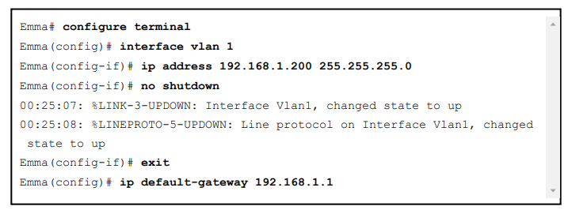

- To administratively enable an interface on a switch, use the **no shutdown** interface subcommand; to disable an interface, use the **shutdown** interface subcommand
- This command can be used on the physical Ethernet interfaces that the switch uses to switch Ethernet messages in addition to the VLAN interface shown here in this example