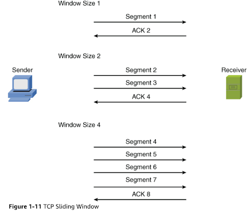

# OSI Model
## Layer 1: Physical Layer
Layer 1 deals with the physical connections between devices. This includes the transmission of bits on the network along with the physical and electrical characteristics of the network. The physical layer defines the following: 

* How to represent bits on the medium
* Wiring standards for connectors and jacks
* Physical topology
* Synchronizing bits
* Bandwidth usage
* Multiplexing strategy
  
### How to represent bits on the medium
Data on a computer network is represented as a binary expression. Electrical voltage (on copper wiring) or light (carried via fiber-optic cabling) can represent these 1s and 0s. 

There are two fundamental ways digital data can be represented using a signal:
1. Current state modulation
2. State transition modulation

In **current state modulation**, data is represented by the current state (or level) of the signal. Each bit corresponds directly to a particular voltage or signal level. For example, the presence or absence of voltage on a wire portrays a binary 1 or a binary 0.

  

Alternatively, there is **state transition modulation** where data is represented by changes (transitions) in the signal, not by the voltage level itself. The presence or absence of a transition at a specific time represents a bit. For example, a transition from low to high can be represented by a 1 while a high to low transition can be represented by a 0. 

### Synchronizing bits
For two networked devices to successfully communicate at the physical layer, they must agree on when one bit stops and another bit starts. Specifically, the devices need a method to
synchronize the bits. Two basic approaches to bit synchronization are asynchronous and synchronous synchronization: 
* **Asynchronous**: With this approach, a sender states that it is about to start transmitting by sending a start bit to the receiver. When the receiver sees this, it starts its own internal clock to measure the next bits. After the sender transmits its data, it sends a stop bit to say that it has finished its transmission. 
* **Synchronous**: This approach synchronizes the internal clocks of the sender and the receiver to ensure that they agree on when bits begin and end. A common approach to make this synchronization happen is to use an external clock (for example, a clock provided by a service provider). The sender and receiver then reference this external clock.

### Bandwidth usage
The two fundamental approaches to bandwidth usage on a network are broadband and baseband: 
* **Broadband**: Broadband technologies divide the bandwidth available on a medium (for example, copper or fiber-optic cabling) into different channels. A sender can then transmit different communication streams over the various channels. For example, consider frequency-division multiplexing (FDM) used by a cable modem. Specifically, a cable modem uses certain ranges of frequencies on the cable coming into your home from the local cable company to carry incoming data, another range of frequencies for outgoing data, and several other frequency ranges for various TV stations. 
* **Baseband**: Baseband technologies use all the available frequencies on a medium to send data. Ethernet is an example of a networking technology that uses baseband.

### Multiplexing strategy
Multiplexing allows multiple communications sessions to share the same physical medium. Cable TV for example, allows you to receive multiple channels over a single physical medium (ie. a coaxial cable plugged into the back of your television). Here are some of the most common approaches to multiplexing: 
* **Time-division multiplexing (TDM)**: TDM supports different communication sessions (for example, different telephone conversations in a telephony network) on the same physical medium by causing the sessions to take turns. For a brief period, defined as a time slot, data from the first session is sent, followed by data from the second session. This continues until all sessions have had a turn, and the process repeats. 
* **Statistical time-division multiplexing (StatTDM)**: A downside to TDM is that each communication session receives its own time slot, even if one of the sessions does not have any data to send at the moment. To make more efficient use of available bandwidth, StatTDM dynamically assigns time slots to communications sessions on an as-needed basis.
* **Frequency-division multiplexing (FDM)**: FDM divides a medium’s frequency range into channels, and different communication sessions send their data over different channels. As previously described, this approach to bandwidth usage is called broadband.
* **Orthogonal frequency-division multiplexing (OFDM)**: OFDM encodes digital data onto multiple carrier frequencies. OFDM is very popular today and is used in wideband digital communication. This makes OFDM useful in applications such as digital television and audio broadcasting, DSL Internet access, wireless networks, powerline networks, and 4G/5G mobile communications. 
* **Orthogonal frequency-division multiple access (OFDMA)**: OFDMA is a multiuser version of the popular OFDM digital modulation scheme. It divides a wireless channel into subchannels to allow simultaneous data transmission from multiple users, enhancing network efficiency and reducing latency. Examples of devices defined by physical layer standards include legacy hubs, wireless access points, and network cabling.

## Layer 2: The Data Link Layer
The data link layer is concerned with the following:
* Packaging data into frames and transmitting those frames on the network
* Ensuring that frames do not exceed the maximum transmission unit (MTU) of the physical media
* Performing error detection/correction
* Uniquely finding network devices with addresses 
* Handling flow control

In fact, the data link layer is distinct from the other layers in that it has two sublayers: MAC and LLC
### MAC
Characteristics of the Media Access Control (MAC) sublayer of the data link layer include the following:
* **Physical addressing**: A common example of a Layer 2 address is a MAC address, which is a 48-bit address assigned to a device’s network interface card (NIC). The first 24 bits of the 48-bit address are the vendor code. The last 24 bits of a MAC address are assigned by the manufacturer, and they act as a serial number for the device. No two MAC addresses in the world should have the same value.
* **Logical topology**: Layer 2 devices view a network as a logical (as opposed to physical) topology.
* **Method of transmitting on the media**: With several devices connected to a network, there needs to be some strategy for deciding when a device sends on the media. Otherwise, multiple devices might send at the same time and interfere with one another’s transmissions.

### Logical Link Control
Characteristics of the Logical Link Control (LLC) sublayer of the data link layer include the following:
* **Connection services**: When a device on a network receives a message from another device on the network, that recipient device can give feedback to the sender in the form of an acknowledgment message. The two main functions provided by these acknowledgment messages are as follows: 
  * **Flow control**: Limits the amount of data a sender can send at one time; this prevents the sender from overwhelming the receiver with too much information.
  * **Error control**: Allows the recipient of data to let the sender know whether the expected data frame was not received or whether it was received but is corrupted. The recipient figures out whether the data frame is corrupt by mathematically calculating a checksum of the data received. If the calculated checksum does not match the checksum received with the data frame, the recipient of the data draws the conclusion that the data frame is corrupted and can then notify the sender via an acknowledgment message.
  
* **Synchronizing transmissions**: Senders and receivers of data frames need to coordinate when a data frame is being transmitted and should be received. The three methods of performing this synchronization are detailed here: 
  * **Isochronous**: With isochronous transmission, network devices look to a common device in the network as a clock source, which creates fixed-length time slots. Network devices can determine how much free space, if any, is available within a time slot and then insert data into an available time slot. A time slot can accommodate more than one data frame. Isochronous transmission does not need to provide clocking at the beginning of a data string (as does synchronous transmission) or for every data frame (as does asynchronous transmission). As a result, isochronous transmission uses little overhead compared to asynchronous or synchronous transmission methods. 
  
  * **Asynchronous**: With asynchronous transmission, network devices reference their own internal clocks, and network devices do not need to synchronize their clocks. Instead, the sender places a start bit at the beginning of each data frame and a stop bit at the end of each data frame. These start and stop bits tell the receiver when to monitor the medium for the presence of bits. An additional bit, called the parity bit, might also be added to the end of each byte in a frame to detect an error in the frame.

  * **Synchronous**: With synchronous transmission, two network devices that want to communicate between themselves must agree on a clocking method to show the beginning and ending of data frames. One approach to providing this clocking is to use a separate communications channel over which a clock signal is sent. Another approach relies on specific bit combinations or control characters to indicate the beginning of a frame or a byte of data. Like asynchronous transmissions, synchronous transmissions can perform error detection. However, rather than using parity bits, synchronous communication runs a mathematical algorithm on the data to create a cyclic redundancy check (CRC). If the sender and the receiver calculate the same CRC value for the same chunk of data, the receiver can conclude that the data was not corrupted during transmission
  
## Layer 3: The Network Layer
* The network layer is primarily concerned with forwarding data based on logical addresses
* Although many network administrators think of routing and IP addressing when they hear about the network layer, this layer is actually responsible for a variety of tasks: 
  
  * **Logical addressing**:
    * Whereas the data link layer uses physical addresses to make forwarding decisions, the network layer uses logical addressing to make forwarding decisions
    * The most widely deployed routed protocol is Internet Protocol (IP)
  * **Switching**:
    * Engineers often associate the term switching with Layer 2 technologies; however, the concept of switching also exists at Layer 3
    * Switching, at its essence, is making decisions about how data should be forwarded
    * At Layer 3, three common switching techniques exist: 
      * **Packet switching**:
        * With packet switching, a data stream is divided into packets
        * Each packet has a Layer 3 header that includes source and destination Layer 3 addresses 
        * Another term for packet switching is routing
      * **Circuit switching**: 
        * Circuit switching dynamically brings up a dedicated communication link between two parties for those parties to communicate
        * As a simple example of circuit switching, think of making a phone call from your home to a business. In fact, let’s go “old school” and pretend you have a traditional landline servicing your phone, the telephone company’s switching equipment interconnects your home phone with the phone system of the business you are calling. This interconnection (that is, circuit) exists only for the duration of the phone call 
      * **Message switching**: 
        * Unlike packet switching and circuit switching technologies, message switching is usually not well suited for real-time applications because of the delay involved
        * Specifically, with message switching, a data stream is divided into messages
        * Each message is tagged with a destination address, and the messages travel from one network device to another network device on the way to their destination
        * Because these devices might briefly store the messages before forwarding them, a network using message switching is sometimes called a store-and-forward network
        * Metaphorically, you could visualize message switching like routing an email message, where the email message might be briefly stored on an email server before being forwarded to the recipient
  * **Route discovery and selection**:
    * Because Layer 3 devices make forwarding decisions based on logical network addresses, a Layer 3 device might need to know how to reach various network addresses
    * For example, a common Layer 3 device is a router. A router can maintain a routing table indicating how to forward a packet based on the packet’s destination network address
    * A router can have its routing table populated via manual configuration (that is, by entering static routes), via a dynamic routing protocol (for example, OSPF or EIGRP), or simply by being directly connected to certain networks
  * **Connection services**:
    * Just as the data link layer offers connection services for flow control and error control, connection services also exist at the network layer
    * Connection services at the network layer can improve the communication reliability if the data link’s LLC sublayer is not performing connection services
    * The following functions are performed by connection services at the network layer: 
      * **Flow control**: 
        * Helps prevent a sender from sending data more rapidly than the receiver is capable of receiving
      * **Packet reordering**: 
        * Allows packets to be placed in the proper sequence as they are sent to the receiver
        * This might be necessary because some networks support load balancing, where multiple links are used to send packets between two devices
        * Because multiple links exist, packets might arrive out of order
 
 ## Layer 4: The Transport Layer
 * The transport layer acts as a dividing line between the upper layers and lower layers of the OSI model
 * Specifically, messages are taken from upper layers (Layers 5–7) and are encapsulated into segments for transmission to the lower layers (Layers 1–3)
 * Similarly, data streams coming from lower layers are decapsulated and sent to Layer 5 (the session layer), or some other upper layer, depending on the protocol
 * Two common transport layer protocols are TCP and UDP: 
   * **Transmission Control Protocol (TCP)**:
     * TCP is a connection-oriented transport protocol
     * Connection-oriented transport protocols offer reliable transport, in that if a segment is dropped, the sender can detect the drop and retransmit the dropped segment
     * Specifically, a receiver acknowledges segments that it receives
     * Based on those acknowledgments, a sender can decide which segments were successfully received and which segments need to be transmitted again
   * **User Datagram Protocol (UDP)**:
     * UDP is a connectionless transport protocol
     * Connectionless transport protocols offer unreliable transport, in that if a segment is dropped, the sender is unaware of the drop, and no retransmission occurs
 * Two common flow control approaches at Layer 4 are windowing and buffering: 
    * **Windowing**:
      * TCP communication uses windowing, in that one or more segments are sent at one time, and a receiver can attest to the receipt of all the segments in a window with a single acknowledgment
      * In some cases, as illustrated in Figure 1-11, TCP uses a sliding window, where the window size begins with one segment
      * If there is a successful acknowledgment of that one segment (that is, the receiver sends an acknowledgment asking for the next segment), the window size doubles to two segments 
      * Upon successful receipt of those two segments, the next window holds four segments
      * This exponential increase in window size continues until the receiver does not acknowledge successful receipt of all segments within a certain amount of time—known as the round-trip time (RTT), which is sometimes called real transfer time—or until a configured maximum window size is reached

      

    * **Buffering**:
      * With buffering, a device (for example, a router) uses a chunk of memory (sometimes called a buffer or a queue) to store segments if bandwidth is not available to send those segments
      * A queue has finite capacity, however, and can overflow (that is, drop segments) in the event of sustained network congestion

