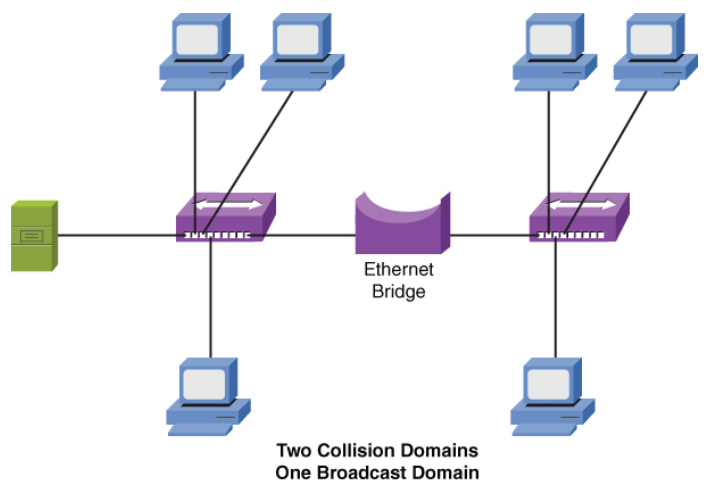
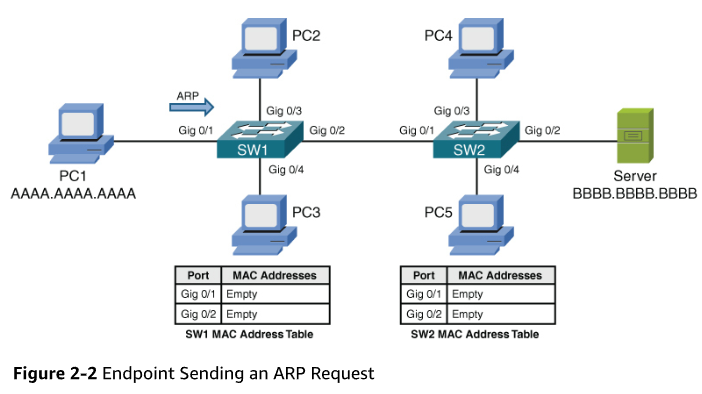
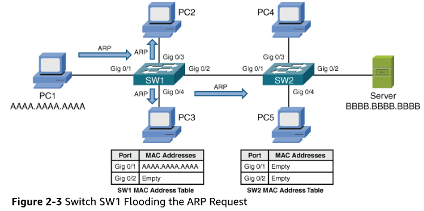
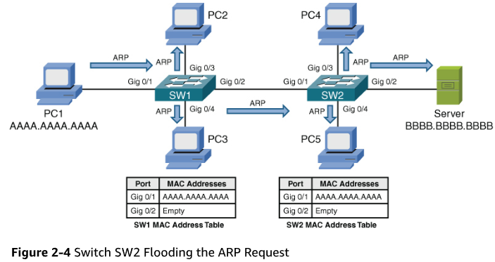
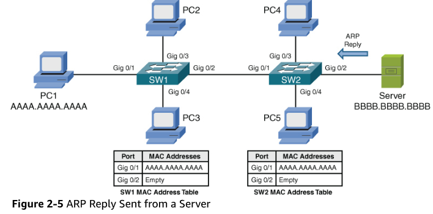
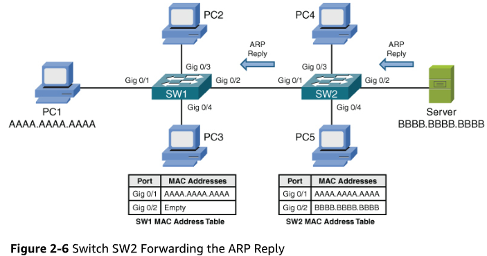
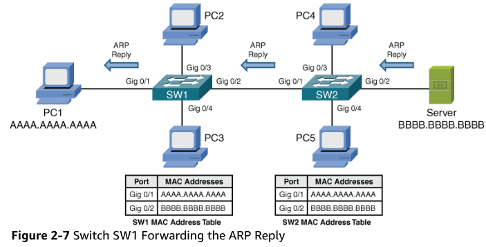
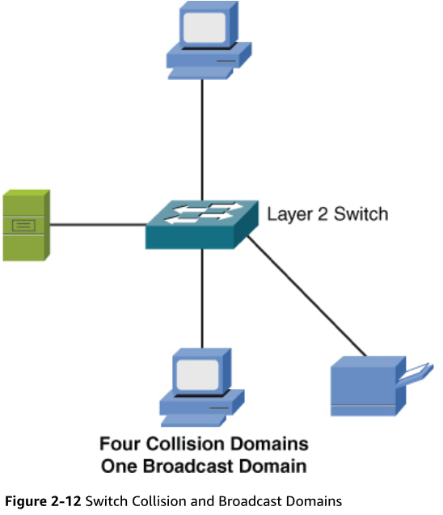
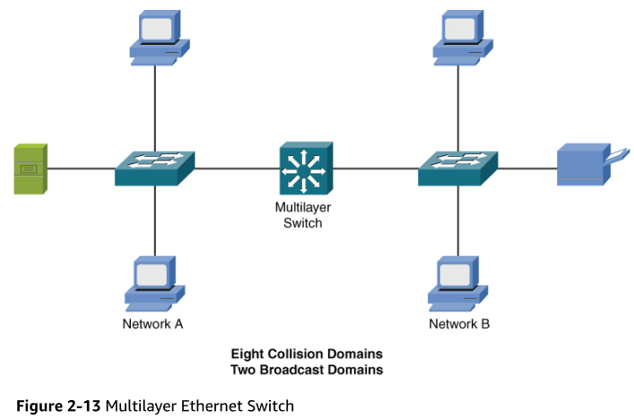
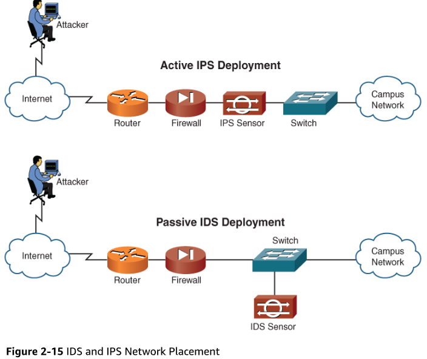

# Routers
* Although a router is considered to be a Layer 3 device it has the capability to consider high-layer traffic parameters, such as quality of service (QoS) settings, in making forwarding decisions
* Routers do not forward broadcast packets by default. This means that each port on a router automatically creates a separate broadcast domain
* Each port also creates a separate collision domain
* What is a collision domain? A collision domain represents an area on a LAN on which there can be only one transmission at a time
* Thanks to the elimination of legacy hubs and bridges in the modern network, our networks today feature microsegmentation
* This means we eliminate the possibility of frame collisions by automatically creating tiny collision domains for each port
* Figure 2-1 shows how each port on a router is a separate collision domain and a separate broadcast domain:
  * Notice this figure also shows two Layer 2 switches
  * These devices do not automatically create broadcast domains by default, but they do help microsegment the network
  * Each port on the switch represents a collision domain just like a router
 
  

# Switches
* Layer 2 switches dynamically learn the MAC addresses attached to various ports by looking at the source MAC addresses on frames coming into a port
* Initially, however, a switch is unaware of what MAC addresses reside off which ports (unless MAC addresses have been statically configured)
* Therefore, when a switch receives a frame destined for a MAC address not yet present in the switch’s MAC address table, the switch floods that frame out all the switch ports except the port on which the frame was received
* Similarly, broadcast frames (that is, frames with destination MAC address FFFF.FFFF.FFFF) are always flooded out of all switch ports except the port on which the frame was received
* The reason broadcast frames are always flooded is that no endpoint will have MAC address FFFF.FFFF.FFFF, which means that the FFFF.FFFF.FFFF MAC address will never be learned in a switches MAC address table
  
 

* If PC1 does not already have the server’s MAC address in its Address Resolution Protocol (ARP) cache, PC1 can send an ARP request in an attempt to learn the server’s MAC address, as shown in Figure 2-2
  
  
* When switch SW1 sees PC1’s ARP request enter port Gigabit 0/1, PC1’s MAC address AAAA.AAAA.AAAA is added to switch SW1’s MAC address table
* Also, because the ARP request is a broadcast, its destination MAC address is FFFF.FFFF.FFFF
* Because the MAC address FFFF.FFFF.FFFF is not known to switch SW1’s MAC address table, switch SW1 floods a copy of the incoming frame out all switch ports other than the port on which the frame was received, as shown in Figure 2-3

  
* When switch SW2 receives the ARP request over its Gig 0/1 trunk port, the source MAC address AAAA.AAAA.AAAA is added to switch SW2’s MAC address table, as illustrated in Figure 2-4
* Also, using behavior similar to that of switch SW1, switch SW2 floods the broadcast

  
* The server receives the ARP request and responds with an ARP reply, as shown in Figure 2-5
* Unlike the ARP request, however, the ARP reply frame is not a broadcast frame. The ARP reply, in this example, has a destination MAC address AAAA.AAAA.AAAA, which makes the ARP reply a unicast frame

  
* Upon receiving the ARP reply from the server, switch SW2 adds the server’s MAC address BBBB.BBBB.BBBB to its MAC address table, as shown in Figure 2-6
* Also, the ARP reply is only sent out port Gig 0/1 because switch SW1 knows that the destination MAC address AAAA.AAAA.AAAA is available off port Gig 0/1

  
* When receiving the ARP reply in its Gig 0/2 port, switch SW1 adds the server’s MAC address BBBB.BBBB.BBBB to its MAC address table
* Also, like switch SW2, switch SW1 now has an entry in its MAC address table for the frame’s destination MAC address AAAA.AAAA.AAAA
* Therefore, switch SW1 forwards the ARP reply out port Gig 0/1 to the endpoint of PC1, as illustrated in Figure 2-7

  
* After receiving the server’s ARP reply, PC1 knows the MAC address of the server
* Therefore, PC1 can now properly construct an SSH segment destined for the server
* Because PC1 learned the server’s MAC address as a result of its earlier ARP request and stored that result in its local ARP cache, the transmission of subsequent Telnet segments does not require additional ARP requests
* However, if unused for a period of time, entries in a PC’s ARP cache can time out
* Therefore, the PC would have to broadcast another ARP frame if it needed to send traffic to the same destination IP address
* The sending of the additional ARP frames adds a small amount of delay when reestablishing a session with that destination IP address

 

* As shown in Figure 2-12, each port on a switch represents a separate collision domain
* Also, all ports on a switch belong to the same broadcast domain, with one exception: when the ports on a switch have been divided into separate virtual LANs (VLANs)
* Remember that each VLAN represents a separate broadcast domain, and for traffic to travel from one VLAN to another, that traffic must be routed by a Layer 3 device

* Whereas a Layer 2 switch makes forwarding decisions based on MAC address information, a multilayer switch can make forwarding decisions based on upper-layer information
* Some literature refers to a multilayer switch as a Layer 3 capable switch because of the switch’s capability to make forwarding decisions like a router
* The term multilayer switch is more accurate, however, because many multilayer switches have policy-based routing features that allow upper-layer information (for example, application port numbers) to be used in making forwarding decisions

* As on a Layer 2 switch, each port on a multilayer switch represents a separate collision domain; however, a characteristic of a multilayer switch (and a router) is that it can become a boundary of a broadcast domain
* Although all ports on a Layer 2 switch belong to the same broadcast domain, if configured as such, all ports on a multilayer switch can belong to different broadcast domains

# IDS vs IPS
* Because the analyzed traffic does not flow through the IDS device, the IDS device is considered to be **passive**, and the IPS device is considered to be **active**
* Although an IDS device can also communicate with a security appliance or a router to prevent subsequent attack packets, the initially offending traffic reaches its destination
* Conversely, an IPS device can drop the traffic inline, thus preventing even the first malicious packet from reaching its intended target

# IDS/IPS Device Categories
* IDS and IPS devices can be categorized based on how they detect malicious traffic
* Consider the following approaches to detecting malicious traffic:
  * Signature-based detection
  * Policy-based detection
  * Anomaly-based detection
  
* **Signature Based Detection**
  * The primary method used to detect and prevent attacks using IDS or IPS technologies is signature based
  * A signature could be a string of bytes that, in a certain context, triggers detection
  * For example, attacks against a web server typically take the form of URLs. Therefore, URLs could be searched for a certain string that would identify an attack against a web server
  * As another example, the IDS or IPS device could search for a pattern in the MIME header of an email message
* **Policy Based Detection**
  * With a policy-based approach, the IDS/IPS device needs a specific declaration of the security policy
  * For example, you could write a network access policy that identifies which networks can communicate with other networks. The IDS/IPS device could then recognize out-of-profile traffic that does not conform to the policy and report that activity
  * Policy-based detection could also identify unencrypted channels and plaintext credentials and insecure protocols such as Telnet, SNMPv1, SNMPv2, HTTP, FTP, SLIP, and TFTP
	
* **Anomaly Based Detection**
  * This approach is prone to false positives because a normal condition is difficult to measurably define
  * However, there are a couple of options for detecting anomalies:
    * **Statistical anomaly detection**: 
      * This approach involves watching network traffic patterns over a period of time and dynamically building a baseline
      * Then, if traffic patterns significantly vary from the baseline, an alarm can be triggered
    * **Nonstatistical anomaly detection**:
      * This approach allows an administrator to define what traffic patterns are supposed to look like
      * However, imagine that Microsoft releases a large update for its Windows 10 OS, and your company has hundreds of computers that are configured to automatically download that service pack. If multiple employees turn on their computers at approximately the same time tomorrow morning, and multiple copies of the service pack simultaneously start to download, the IDS/IPS device might consider that traffic pattern to be significantly outside the baseline
      * As a result, the nonstatistical anomaly detection approach could lead to a false positive
      * However, an anomaly-based IPS may be able to indicate abnormal behavior, compared to the baseline of normal activity, which could assist you in discovering a new type of attack that is being used against your network

# Load Balancer
* A load balancer is a network device or software component that distributes incoming network traffic across multiple servers, systems, or resources in a network, ensuring optimal utilization of resources, high availability, and improved performance
* Load balancers operate at the application layer (Layer 7) or transport layer (Layer 4) of the OSI model and use various algorithms, such as round-robin, least connections, or weighted distribution, to evenly distribute incoming requests or connections among the backend servers
* The load balancer can also check the health of the nodes periodically and intelligently prevent the forwarding of web requests to servers that are sickly

# Proxy Servers
* Some clients are configured to forward their packets, which are seemingly destined for the Internet, to a proxy server
* The proxy server receives the client’s request, and on behalf of that client (that is, as that client’s proxy), the proxy server sends the request out to the Internet
* When a reply is received from the Internet, the proxy server forwards the response on to the client

* Because all requests going out to the Internet are sourced from the proxy server, the IP addresses of network devices inside the trusted network are hidden from the Internet
* Many proxy servers perform content caching and thus can save bandwidth:
  * For example, without a proxy server, if multiple clients all visited the same website, the same graphics from the home page of the website would be downloaded multiple times (one time for each client visiting the website)
  * However, with a proxy server performing content caching, when the first client navigates to a website on the Internet, and the Internet-based web server returns its content, the proxy server not only forwards this content to the client requesting the web page but also stores a copy of the content on its hard drive
  * Then, when a subsequent client points its web browser to the same website, after the proxy server determines that the page has not changed, the proxy server can locally serve up the content to the client, without having to once again consume Internet bandwidth to download all the graphic elements from the Internet-based website 
* Some proxy servers can perform content filtering to restrict clients from accessing certain URLs
* A reverse proxy receives requests on behalf of a server or servers and replies back to the clients on behalf of those servers
* Reverse proxies can also be used with load-balancing and caching to better utilize a group of servers providing scalability and high availability

