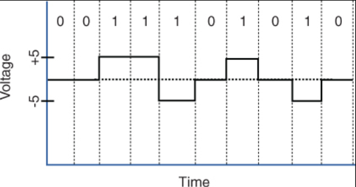
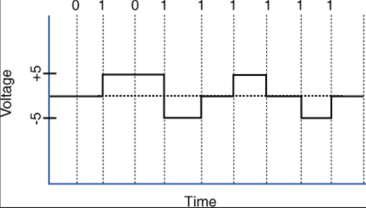

# OSI Model
## Layer 1: Physical Layer
Layer 1 deals with the physical connections between devices. This includes the transmission of bits on the network along with the physical and electrical characteristics of the network. The physical layer defines the following: 

* How to represent bits on the medium
* Wiring standards for connectors and jacks
* Physical topology
* Synchronizing bits
* Bandwidth usage
* Multiplexing strategy
  
### How to represent bits on the medium
Data on a computer network is represented as a binary expression. Electrical voltage (on copper wiring) or light (carried via fiber-optic cabling) can represent these 1s and 0s. 

There are two fundamental ways digital data can be represented using a signal:
1. Current state modulation
2. State transition modulation

In **current state modulation**, data is represented by the current state (or level) of the signal. Each bit corresponds directly to a particular voltage or signal level. For example, the presence or absence of voltage on a wire portrays a binary 1 or a binary 0.

  

Alternatively, there is **state transition modulation** where data is represented by changes (transitions) in the signal, not by the voltage level itself. The presence or absence of a transition at a specific time represents a bit. For example, a transition from low to high can be represented by a 1 while a high to low transition can be represented by a 0. 

### Synchronizing bits
For two networked devices to successfully communicate at the physical layer, they must agree on when one bit stops and another bit starts. Specifically, the devices need a method to
synchronize the bits. Two basic approaches to bit synchronization are asynchronous and synchronous synchronization: 
* **Asynchronous**: With this approach, a sender states that it is about to start transmitting by sending a start bit to the receiver. When the receiver sees this, it starts its own internal clock to measure the next bits. After the sender transmits its data, it sends a stop bit to say that it has finished its transmission. 
* **Synchronous**: This approach synchronizes the internal clocks of the sender and the receiver to ensure that they agree on when bits begin and end. A common approach to make this synchronization happen is to use an external clock (for example, a clock provided by a service provider). The sender and receiver then reference this external clock.

### Bandwidth usage
The two fundamental approaches to bandwidth usage on a network are broadband and baseband: 
* **Broadband**: Broadband technologies divide the bandwidth available on a medium (for example, copper or fiber-optic cabling) into different channels. A sender can then transmit different communication streams over the various channels. For example, consider frequency-division multiplexing (FDM) used by a cable modem. Specifically, a cable modem uses certain ranges of frequencies on the cable coming into your home from the local cable company to carry incoming data, another range of frequencies for outgoing data, and several other frequency ranges for various TV stations. 
* **Baseband**: Baseband technologies use all the available frequencies on a medium to send data. Ethernet is an example of a networking technology that uses baseband.

### Multiplexing strategy
Multiplexing allows multiple communications sessions to share the same physical medium. Cable TV for example, allows you to receive multiple channels over a single physical medium (ie. a coaxial cable plugged into the back of your television). Here are some of the most common approaches to multiplexing: 
* **Time-division multiplexing (TDM)**: TDM supports different communication sessions (for example, different telephone conversations in a telephony network) on the same physical medium by causing the sessions to take turns. For a brief period, defined as a time slot, data from the first session is sent, followed by data from the second session. This continues until all sessions have had a turn, and the process repeats. 
* **Statistical time-division multiplexing (StatTDM)**: A downside to TDM is that each communication session receives its own time slot, even if one of the sessions does not have any data to send at the moment. To make more efficient use of available bandwidth, StatTDM dynamically assigns time slots to communications sessions on an as-needed basis.
* **Frequency-division multiplexing (FDM)**: FDM divides a medium’s frequency range into channels, and different communication sessions send their data over different channels. As previously described, this approach to bandwidth usage is called broadband.
* **Orthogonal frequency-division multiplexing (OFDM)**: OFDM encodes digital data onto multiple carrier frequencies. OFDM is very popular today and is used in wideband digital communication. This makes OFDM useful in applications such as digital television and audio broadcasting, DSL Internet access, wireless networks, powerline networks, and 4G/5G mobile communications. 
* **Orthogonal frequency-division multiple access (OFDMA)**: OFDMA is a multiuser version of the popular OFDM digital modulation scheme. It divides a wireless channel into subchannels to allow simultaneous data transmission from multiple users, enhancing network efficiency and reducing latency. Examples of devices defined by physical layer standards include legacy hubs, wireless access points, and network cabling.
